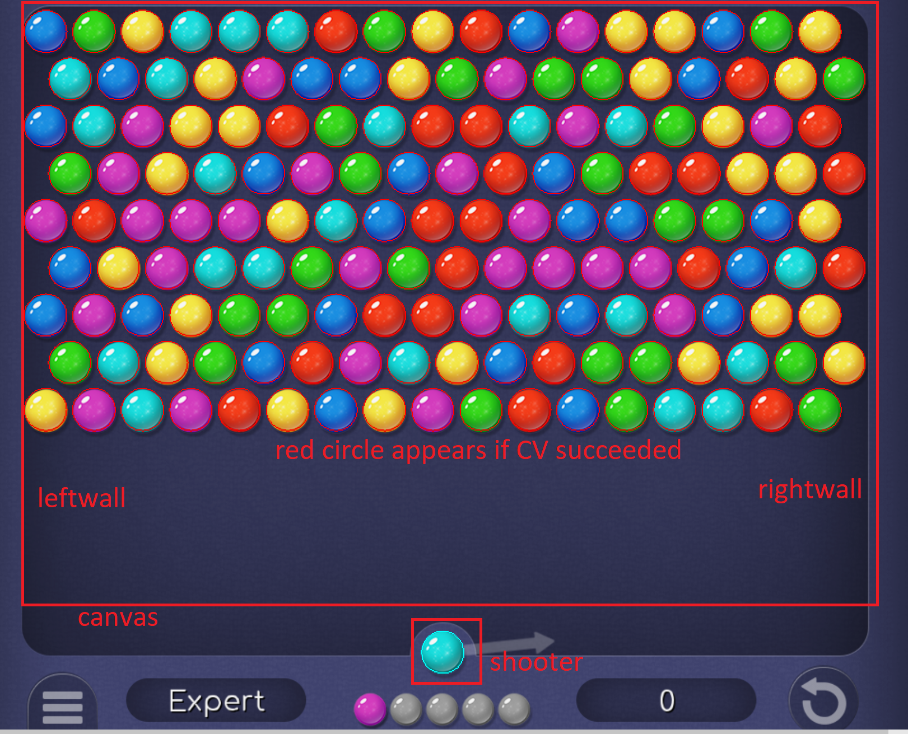

# BubbleShotter

Cheater for bubble shooter game. Only for windows. Use image recognition to detect bubbles so in principle works for arbitrary websites.

Dependency:

    python >= 3.8
    PyQt6
    OpenCV
    win32api
    win32con

Usage:

(1) `pythonw bubbleshotter.py`
(2) You should notice a control panel, and an almost transparent selection panel appearing at the middle of the screen. Please put your game window under the panel.
(3) Click identify shooter, drag the rectangle around the shooter. You can click the small buttons on the right for further adjust.
(4) Do the same thing for left and right walls.
(5) Click identify canvas, draw the rectangle to cover all bubbles (please drag the rectangle bottom lower to cover all possible FUTURE positions, but not the shooter). You may try several times.
(6) +hit and -hit adjust the collision detection radius.
(7) Run and Stop are for manual mode. Autorun is for automatic running. It uses your mouse.
(8) Close the control panel to exit the program.

Works best for [Bubble Shooter HD](https://www.msn.com/en-us/play/games/bubble-shooter-hd/cg-9nzvl6gzqhkj?cgfrom=cg_landing_home_bubble)

